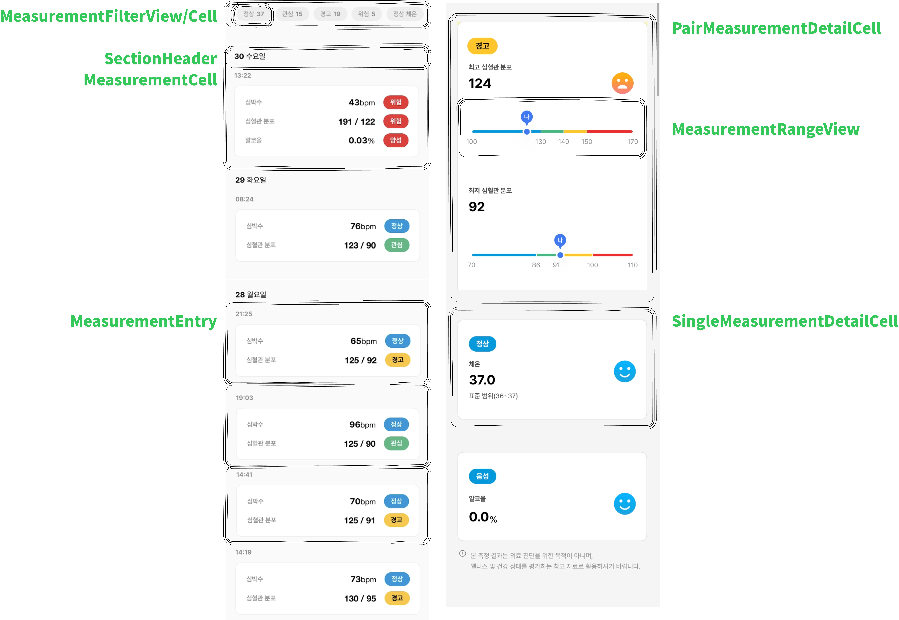
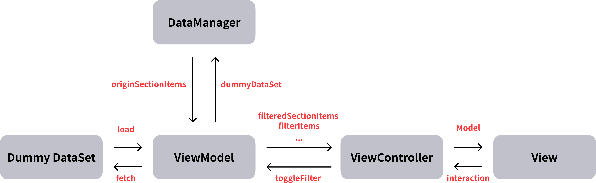

# Deepmedi Assignment

### 개발 환경
- Xcode: 16.3
- iOS: 18.0+
- Swift: 5.9+
- Tech: UIKit, MVVM, RxSwift, RxCocoa, SnapKit
- Simulator: iPhone 14

<br><br>

### 폴더링
```swift
Sources/
├── App/                                               # 앱 진입점
│   ├── AppDelegate.swift
│   └── SceneDelegate.swift
├── Entity/                                            # 데이터 엔티티
│   ├── Dummy.swift                                    # 더미 데이터
│   └── TargetItem.swift                               # 측정 아이템
├── Manager/                                           # 데이터 관리
│   └── MeasurementDataManager.swift
├── Model/                                             # 비즈니스 모델
│   ├── MeasurementType.swift
│   ├── MeasurementValue.swift
│   ├── Status.swift
│   └── Sections.swift
└── Presenter/                                         # UI 레이어
    ├── ViewControllers/                               # 뷰 컨트롤러
    │   ├── MeasurementListViewController.swift
    │   ├── MeasurementDetailViewController.swift
    ├── ViewModels/                                    # 뷰모델
    │   ├── MeasurementListViewModel.swift
    │   ├── MeasurementDetailViewModel.swift
    └── Cells/                                         # 셀
    │   ├── MeasurementCell.swift
    │   ├── MeasurementFilterCell.swift
    │   ├── PairMeasurementDetailCell.swift
    │   ├── SingleMeasurementDetailCell.swift
    └── Views/                                         # 커스텀 뷰
        ├── MeasurementRangeView.swift
        ├── MeasurementFilterView.swift
        └── MeasurementSectionHeaderView.swift
```

##  주요 기능
###  측정 데이터 관리
- 4가지 `TargetItem` 더미 데이터셋을 **확장 가능한 외부 데이터로 가정**
  - `1번 데이터`
  - `2번 데이터`
  - `3번 데이터`
  - `4번 데이터`

<br><br>

### 목록 화면
- 측정 데이터를 MeasurementDataManager로 날짜별로 정리한 SectionItems 반환하여 ViewController에 전달
- 상태 별 필터 및 개수 표시: `MeasurementDataManager`가 반환한 `originSectionItems` 실시간 스트림 분기를 통해 각 필터 `CellModel(= MeasureFilterItem)`와 리스트의 날짜 별 디스플레이를 위한 `SectionItem(= [DateSectionItem])` 생성
- 실시간 업데이트: Rx 활용 이벤트 스트림 관리로 필터 변경 이벤트 발생 시 즉시 반영
  

<br><br>

### 상세 화면
- `MeasurementValue` 프로토콜로 디스플레이할 데이터 확장성 고려(아래 구조체는 MeasurementValue를 채택)
  - `PairMeasurement -> PairMeasurementDetailCell`: 1번/2번 데이터를 함께 쌍으로 표시
  - `SingleMeasurement -> SingleMeasurementDetailCell`: 단일 측정 데이터 표시 -> 개별 표시되는 3, 4번 데이터(요구 사항에 따라 3, 4번 데이터는 `MeasurementRangeView` 생략)
- `MeasurementRangeView`: 측정값의 상태를 시각적으로 표시

<br><br>

### UI 요구사항


<br><br>

### 데이터 흐름 간략화


<br><br>

### 스크린샷

| 리스트 UI | 결과 UI | 
| :---------: | :-----------: |
|  |  |